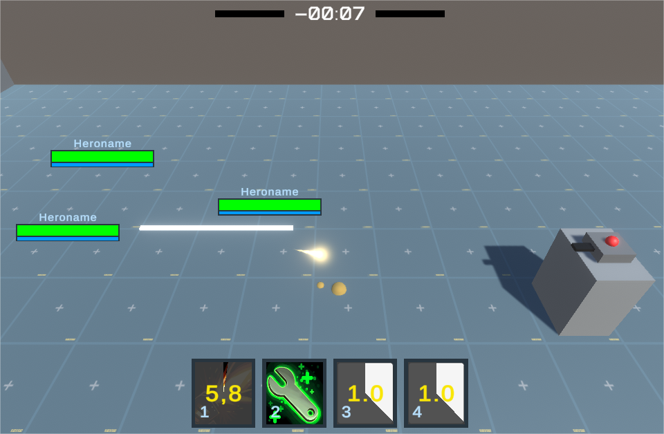
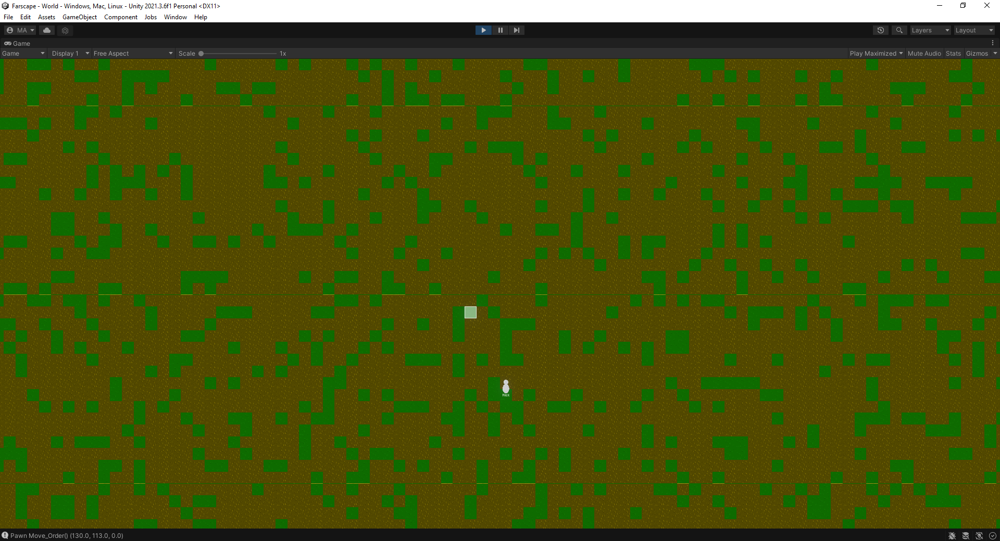
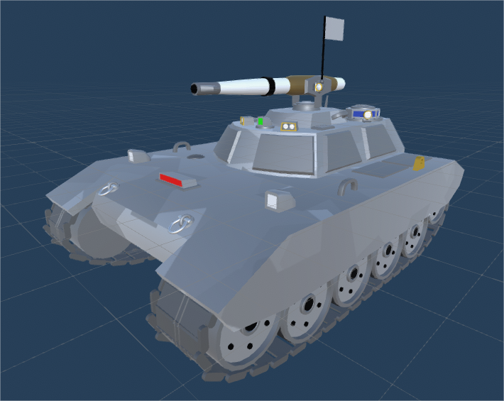
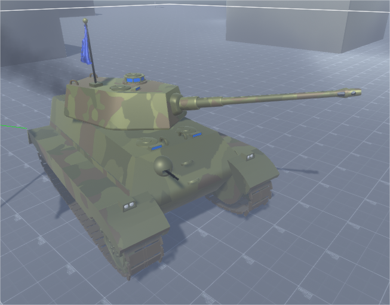
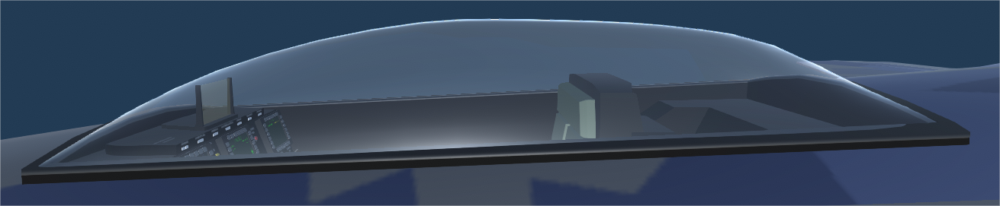
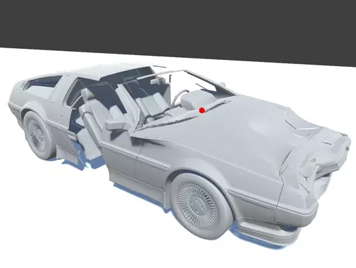
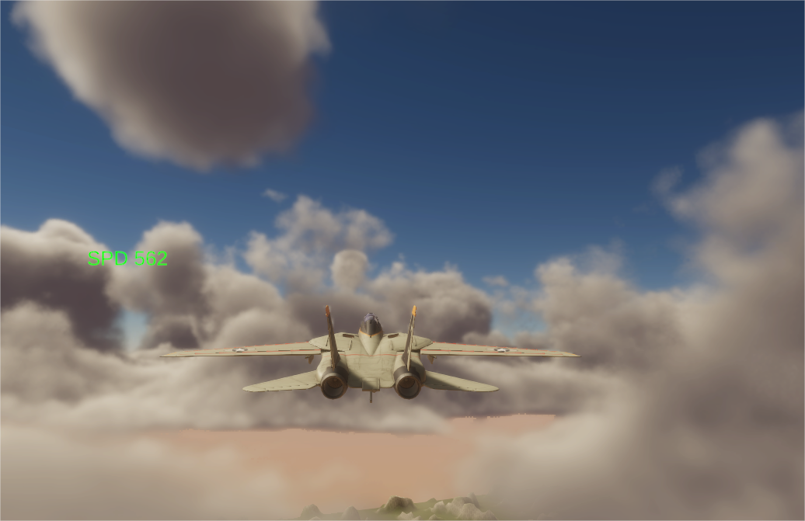
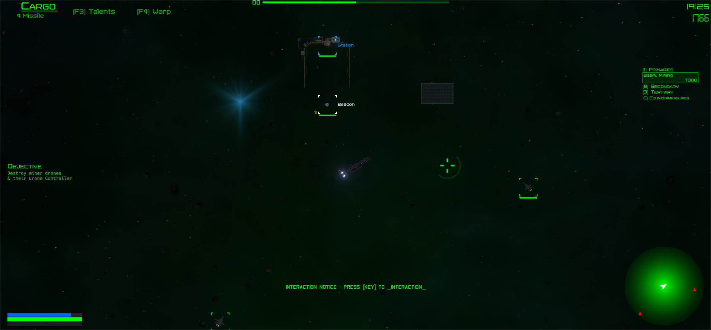

# coding-compilation

<!-- This is a comment ; Pls note, below image methods gotten from: https://stackoverflow.com/questions/14494747/how-to-add-images-to-readme-md-on-github -->
<!--  -->
<!-- (https://github.com/Greyrib/coding-compilation/blob/main/MT_State2nd_AW.png?raw=true) -->

<h3>A couple of screenshots of stuff I've worked on.
Not asuper exhaustive list, since a span of 10+ years & humonguous project folders include lots more stuff, but sufficient for an idea of the range.</h3>

<h3>Randomnizing 2D tiles based on noise</h3>

<h3>3D models of C&C:GZH Crusader-style & Koeniggstiger tank</h3>

<h3>3D modeling a two-sided transparent but visible curved cockpit glass surface</h3>

<h3>Runtime mesh deformation</h3>

<h3>Volumetric clouds for arcade flight</h3>

<h3>HOTS/moba-style arena, with mechanics & abilities</h3>

<h3>An early AW project variation, based on SPAZ 1</h3>

